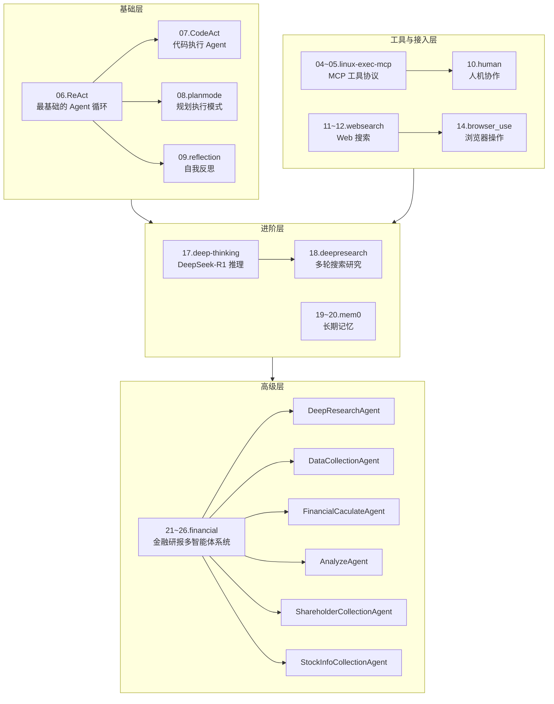
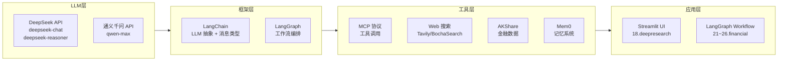
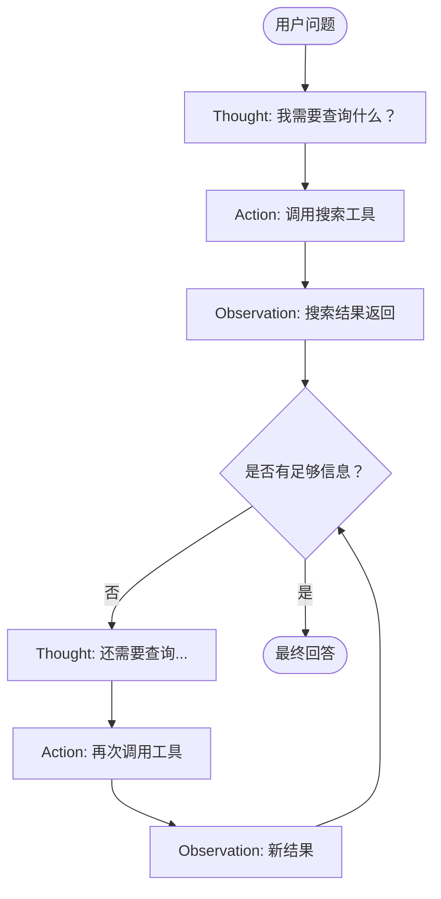
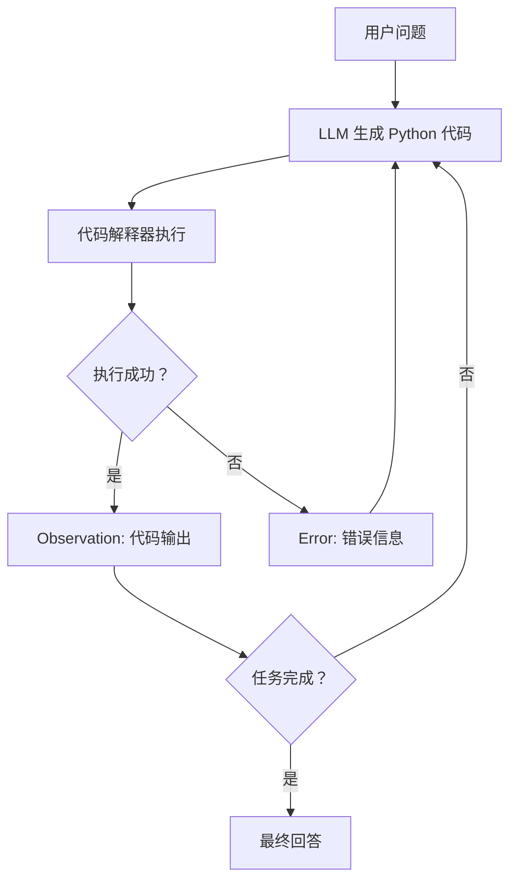
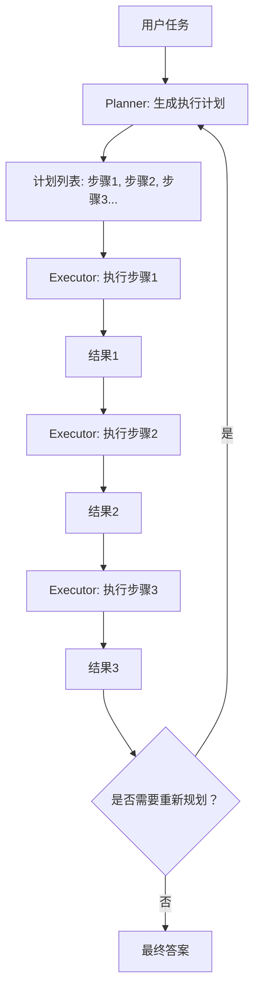
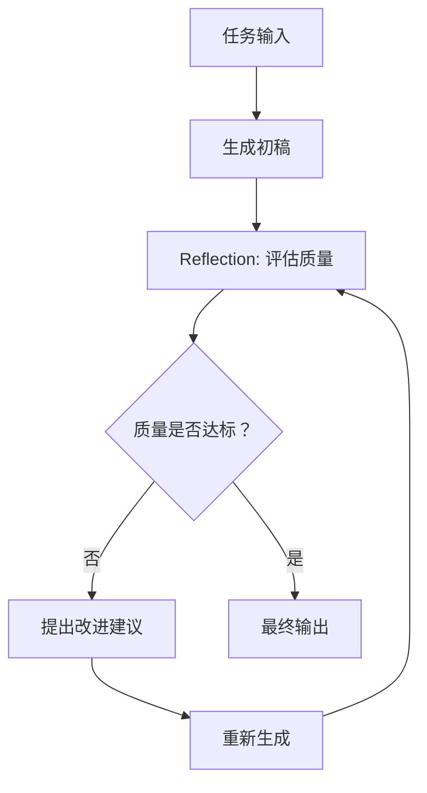
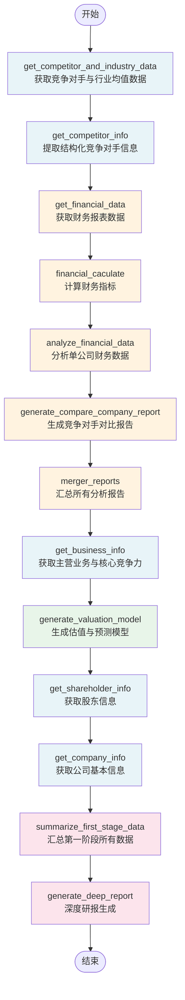
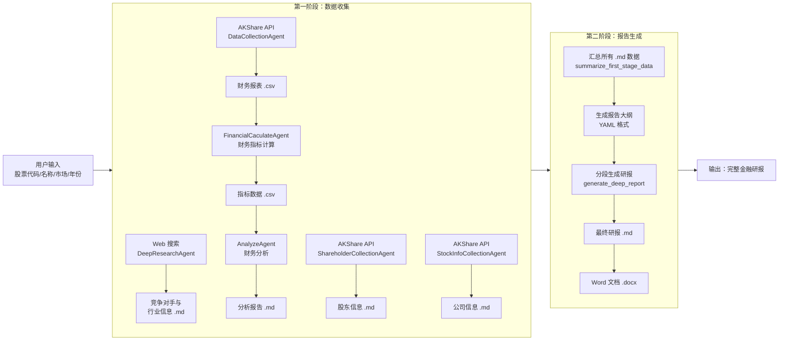
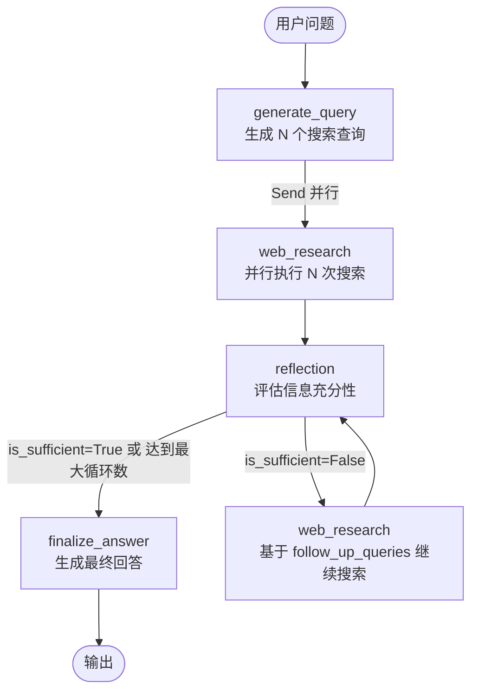

# 技术文档

> 极客时间《DeepResearch前沿智能体实战课》配套代码技术文档

---

## 目录

1. [项目概述](#1-项目概述)
2. [整体架构说明](#2-整体架构说明)
3. [技术栈详解](#3-技术栈详解)
4. [核心模块逐一说明](#4-核心模块逐一说明)
5. [金融研报模块详解](#5-金融研报模块详解)
6. [关键算法说明](#6-关键算法说明)

---

## 1. 项目概述

### 1.1 课程定位

本仓库是极客时间课程《DeepResearch前沿智能体实战课》的配套代码，涵盖从基础 ReAct 智能体到复杂多智能体金融研报系统的完整学习路径。

本课程面向希望掌握大语言模型（LLM）智能体开发的工程师和研究者，通过逐步递进的实战案例，帮助学习者理解并构建真实可用的 AI 智能体系统。

### 1.2 学习目标

- 掌握 LangGraph 工作流编排框架的使用
- 理解 ReAct、CodeAct、Plan & Execute、Reflection 等主流智能体模式
- 学会接入 DeepSeek、通义千问等国内大模型 API
- 能够构建具有长期记忆、Web 搜索、浏览器操作等能力的智能体
- 理解并实现复杂的多智能体协作系统（以金融研报生成为例）

### 1.3 项目价值

| 维度 | 说明 |
|------|------|
| **实战性** | 所有代码均为可运行的真实案例，非玩具示例 |
| **系统性** | 从最简单的函数调用到 13 节点的复杂工作流，循序渐进 |
| **前沿性** | 覆盖 MCP、Mem0、DeepSeek-R1 等最新技术 |
| **工程性** | 包含错误处理、状态管理、并发执行等工程实践 |

### 1.4 项目结构总览

| 目录 | 内容 | 复杂度 |
|------|------|--------|
| `04~05.linux-exec-mcp` | Linux 命令执行 MCP 工具（SSE + Streamable HTTP 两种传输方式） | ⭐⭐ |
| `06.ReAct` | ReAct 推理-行动智能体（基础函数调用 + ReAct 循环） | ⭐⭐ |
| `07.CodeAct` | CodeAct 代码执行智能体 | ⭐⭐⭐ |
| `08.planmode` | Plan & Execute 规划模式（基础版 + 进阶版） | ⭐⭐⭐ |
| `09.reflection` | Reflection 反思机制 | ⭐⭐⭐ |
| `10.human` | Human-in-the-Loop 人机协作 | ⭐⭐⭐ |
| `11~12.websearch` | Web 搜索智能体（BochaSearch + SearXNG） | ⭐⭐⭐ |
| `14.browser_use` | 浏览器使用智能体 | ⭐⭐⭐ |
| `17.deep-thinking` | 深度思考（DeepSeek-R1 推理模型）| ⭐⭐⭐ |
| `18.deepresearch` | DeepResearch 智能体（含 Streamlit UI）| ⭐⭐⭐⭐ |
| `19~20.mem0` | Mem0 长期记忆 | ⭐⭐⭐ |
| `21~26.financial` | 金融智能体（最复杂模块，多 Agent 协作生成研报）| ⭐⭐⭐⭐⭐ |
| `直播二.smolagents` | smolagents 框架直播代码 | ⭐⭐⭐ |
| `直播三.context7` | Context7 MCP 直播代码 | ⭐⭐⭐ |

---

## 2. 整体架构说明

### 2.1 模块关系图



### 2.2 技术架构层次



---

## 3. 技术栈详解

### 3.1 LangGraph

LangGraph 是本项目的核心框架，用于编排多步骤的 AI 工作流。

#### 3.1.1 核心概念

**StateGraph（状态图）**：LangGraph 的核心数据结构，定义了工作流的节点（Node）和边（Edge）。

```python
from langgraph.graph import StateGraph, START, END

# 创建一个状态图
builder = StateGraph(OverallState)

# 添加节点
builder.add_node("node_a", function_a)
builder.add_node("node_b", function_b)

# 添加边（执行顺序）
builder.add_edge(START, "node_a")
builder.add_edge("node_a", "node_b")
builder.add_edge("node_b", END)

# 编译为可执行图
graph = builder.compile()
```

**节点（Node）**：工作流中的每一个处理步骤，本质上是一个 Python 函数，接收状态（State），返回状态更新。

```python
def my_node(state: MyState) -> dict:
    # 处理逻辑
    result = do_something(state["input"])
    # 返回要更新的状态字段
    return {"output": result}
```

**边（Edge）**：节点之间的连接关系。分为普通边（`add_edge`，固定顺序）和条件边（`add_conditional_edges`，根据条件决定下一步）。

```python
# 条件边：根据函数返回值决定路由
builder.add_conditional_edges(
    "reflection",
    evaluate_research,  # 路由函数
    ["web_research", "finalize_answer"]  # 可能的目标节点
)
```

**状态（State）**：贯穿整个工作流的数据容器，使用 `TypedDict` 定义。

```python
from typing import TypedDict
from langgraph.graph import add_messages
from typing_extensions import Annotated

class MyState(TypedDict):
    messages: Annotated[list, add_messages]  # 自动追加消息
    result: str
    count: int
```

> 💡 **初学者提示：** `Annotated[list, add_messages]` 表示 `messages` 字段是列表，且使用 `add_messages` 函数来合并新旧值（追加而非覆盖）。这是 LangGraph 处理消息历史的标准方式。

**Send（并行发送）**：用于向多个节点并行发送任务。

```python
from langgraph.types import Send

def continue_to_web_research(state):
    # 并行启动多个 web_research 节点
    return [
        Send("web_research", {"search_query": query, "id": idx})
        for idx, query in enumerate(state["search_query"])
    ]
```

#### 3.1.2 图的执行方式

```python
# 普通执行（等待全部完成）
result = graph.invoke({"input": "hello"})

# 流式执行（每个节点完成时返回）
for step in graph.stream({"input": "hello"}):
    node_name, output = list(step.items())[0]
    print(f"节点 {node_name} 完成，输出：{output}")
```

### 3.2 LangChain

LangChain 提供了对各种 LLM 的统一抽象接口。

#### 3.2.1 LLM 抽象

```python
from langchain_deepseek import ChatDeepSeek
from langchain_openai import ChatOpenAI

# DeepSeek Chat 模型
llm = ChatDeepSeek(model="deepseek-chat", api_key="your_key")

# 通义千问（通过 OpenAI 兼容接口）
llm = ChatOpenAI(
    model="qwen-max",
    api_key="your_key",
    base_url="https://dashscope.aliyuncs.com/compatible-mode/v1"
)

# 调用方式相同（统一接口）
response = llm.invoke("你好，世界！")
print(response.content)
```

#### 3.2.2 消息类型

LangChain 定义了四种核心消息类型，用于构建对话历史：

| 消息类型 | 说明 | 使用场景 |
|---------|------|---------|
| `HumanMessage` | 人类/用户的消息 | 用户输入、发送给 LLM 的指令 |
| `AIMessage` | AI 模型的回复 | LLM 的输出结果 |
| `SystemMessage` | 系统提示词 | 设置 LLM 的角色和行为规范 |
| `ToolMessage` | 工具调用结果 | 函数调用/MCP 工具的返回值 |

```python
from langchain_core.messages import HumanMessage, AIMessage, SystemMessage, ToolMessage

messages = [
    SystemMessage(content="你是一位专业的金融分析师"),
    HumanMessage(content="请分析贵州茅台的财务状况"),
    AIMessage(content="根据最新财务数据..."),  # LLM 的回复
]

response = llm.invoke(messages)
```

#### 3.2.3 结构化输出

使用 `with_structured_output` 让 LLM 返回符合指定 Schema 的结构化数据：

```python
from pydantic import BaseModel
from typing import List

class CompetitorInfo(BaseModel):
    stock_code: str  # 股票代码
    stock_name: str  # 公司名称
    market: str      # 市场（A股/港股/美股）

class CompetitorInfoList(BaseModel):
    competitors: List[CompetitorInfo]

# 让 LLM 返回结构化数据
llm_with_output = llm.with_structured_output(CompetitorInfoList)
result = llm_with_output.invoke("找出茅台的主要竞争对手")
# result 是 CompetitorInfoList 对象，可以直接用 result.competitors 访问
```

> 💡 **初学者提示：** `with_structured_output` 的底层原理是使用 JSON Schema 约束 LLM 的输出格式，通过 Function Calling 或格式化指令实现。这比手动解析 LLM 输出的 JSON 字符串更可靠。

### 3.3 MCP（Model Context Protocol）

MCP 是 Anthropic 提出的工具调用协议，允许 AI 模型通过标准化接口调用外部工具。

#### 3.3.1 MCP 服务器（工具提供方）

```python
# server-sample.py（简化示例）
from mcp.server.fastmcp import FastMCP

mcp = FastMCP("Linux命令执行服务")

@mcp.tool()
async def execute_command(command: str) -> str:
    """执行 Linux 命令并返回结果"""
    import subprocess
    result = subprocess.run(command, shell=True, capture_output=True, text=True)
    return result.stdout or result.stderr
```

#### 3.3.2 MCP 客户端（工具调用方）

```python
# 使用 MultiServerMCPClient 连接多个 MCP 服务器
from langchain_mcp_adapters.client import MultiServerMCPClient

async with MultiServerMCPClient({
    "linux": {
        "url": "http://localhost:8000/sse",
        "transport": "sse",
    }
}) as client:
    tools = client.get_tools()  # 获取工具列表
    agent = create_react_agent(llm, tools)
    result = await agent.ainvoke({"messages": [...]})
```

### 3.4 DeepSeek API

#### 3.4.1 Chat 模型 vs Reasoner 模型对比

| 特性 | deepseek-chat | deepseek-reasoner（R1）|
|------|--------------|----------------------|
| **模型名称** | `deepseek-chat` | `deepseek-reasoner` |
| **能力** | 通用对话、代码生成、文本处理 | 复杂推理、数学、逻辑分析 |
| **思维过程** | 直接输出答案 | 有内部推理链（Chain of Thought）|
| **速度** | 快 | 慢（需要推理时间）|
| **费用** | 较低 | 较高 |
| **适用场景** | 大多数任务 | 需要深度推理的任务（金融分析、复杂数学）|

```python
# llm.py 中的工厂函数
def DeepSeek():
    """DeepSeek Chat 模型 - 通用任务"""
    return ChatDeepSeek(
        model="deepseek-chat",
        api_key=os.environ.get("DEEPSEEK_API_KEY"),
    )

def DeepSeek_R1():
    """DeepSeek Reasoner 模型 - 复杂推理任务"""
    return ChatDeepSeek(
        model="deepseek-reasoner",
        api_key=os.environ.get("DEEPSEEK_API_KEY"),
    )
```

---

## 4. 核心模块逐一说明

### 4.1 ReAct 模式（06.ReAct）

ReAct（Reasoning + Acting）是最经典的智能体模式，核心循环为：

```
Thought（思考）→ Action（行动）→ Observation（观察）→ Thought...
```



**关键文件：**
- `06.ReAct/react/agent.py`：使用 `create_react_agent` 创建 ReAct 智能体
- `06.ReAct/react/tools.py`：工具定义（用 `@tool` 装饰器）
- `06.ReAct/functioncalling/`：不使用 LangGraph，手动实现函数调用循环

> 💡 **初学者提示：** LangGraph 的 `create_react_agent` 函数已经实现了完整的 ReAct 循环，你只需要提供 LLM 和工具列表即可。

### 4.2 CodeAct 模式（07.CodeAct）

CodeAct 的核心思想是：**用代码执行替代函数调用**。LLM 生成可执行的 Python 代码，由代码解释器执行，将结果反馈给 LLM。



**优势对比：**

| 对比项 | 函数调用（Function Calling）| CodeAct |
|--------|--------------------------|---------|
| 灵活性 | 受限于预定义工具 | 可以执行任意代码 |
| 安全性 | 高（工具已知） | 低（代码可能有风险）|
| 表达能力 | 中 | 高（可以写复杂逻辑）|
| 学习曲线 | 低 | 中 |

### 4.3 Plan & Execute（08.planmode）

**先规划，后执行**。适合需要多步骤协作、步骤之间有依赖关系的复杂任务。



**两个子模块：**
- `planmode-sample/`：简单版，固定计划
- `planmode-advanced/`：进阶版，支持动态重新规划

### 4.4 Reflection（09.reflection）

Reflection（反思）让智能体在完成任务后评估自己的输出质量，并进行迭代改进。



**核心文件：**
- `09.reflection/reflection/graph.py`：反思循环的 LangGraph 实现
- `09.reflection/reflection/prompts.py`：生成 Prompt 和反思 Prompt

### 4.5 Human-in-the-Loop（10.human）

Human-in-the-Loop 允许在工作流执行过程中暂停，等待人工审核或输入。

**实现机制：** LangGraph 的"检查点（Checkpoint）"功能。工作流在特定节点暂停，持久化当前状态，等待人工确认后继续。

```python
# 在需要暂停的节点前添加 interrupt
from langgraph.types import interrupt

def human_review_node(state):
    # 暂停等待人工审核
    human_input = interrupt({
        "question": "请审核以下内容是否正确：",
        "content": state["draft"]
    })
    return {"approved": human_input == "yes"}
```

**关键文件：**
- `10.human/human/graph.py`：包含检查点的工作流
- `10.human/human/tools.py`：人机交互工具

### 4.6 DeepResearch（18.deepresearch）

DeepResearch 是一个多轮搜索+反思的研究智能体，能够自动扩展查询、评估信息充分性，最终生成综合研究报告。

**核心组件：**
- `agent/graph.py`：核心工作流（5个节点）
- `agent/state.py`：状态定义
- `agent/configuration.py`：可配置参数
- `app.py`：Streamlit Web 界面

**工作流节点：**

| 节点 | 功能 |
|------|------|
| `generate_query` | 根据用户问题生成多个搜索查询 |
| `web_research` | 执行网络搜索（并行） |
| `reflection` | 评估搜索结果，识别知识空白 |
| `evaluate_research` | 决定是否继续搜索或生成答案 |
| `finalize_answer` | 整合所有搜索结果，生成最终答案 |

### 4.7 Mem0 记忆（19~20.mem0）

Mem0 提供了跨对话的长期记忆能力，让智能体能够"记住"用户的偏好和历史信息。

**两种记忆模式对比：**

| 对比项 | 短期记忆（LangGraph State）| 长期记忆（Mem0/文件）|
|--------|--------------------------|-------------------|
| 生命周期 | 单次对话 | 跨对话持久化 |
| 存储位置 | 内存 | 数据库/文件系统 |
| 检索方式 | 直接访问 State 字段 | 语义相似度搜索 |
| 容量 | 受上下文窗口限制 | 几乎无限 |

**关键文件：**
- `19~20.mem0/mem0/agent.py`：使用 Mem0 的智能体
- `19~20.mem0/mem0/memconfig.py`：Mem0 配置
- `19~20.mem0/memory/`：使用文件系统实现长期记忆的替代方案

### 4.8 金融研报 Agent（21~26.financial）

这是本课程最复杂的模块，由 13 个节点、6 个子智能体组成的完整金融研报生成系统。详见[第 5 节：金融研报模块详解](#5-金融研报模块详解)。

---

## 5. 金融研报模块详解

### 5.1 工作流总览（13 节点）



**两阶段工作模式：**

- **第一阶段（数据收集）**：节点 1-12，收集和分析所有原始数据
- **第二阶段（报告生成）**：节点 13，基于汇总数据生成最终深度研报

### 5.2 OverallState 字段说明

`OverallState` 是整个工作流的全局共享状态，定义在 `states.py` 中：

| 字段名 | 类型 | 说明 | 由哪个节点写入 |
|--------|------|------|--------------|
| `stock_code` | `str` | 股票代码（如 `"600519"`）| 用户输入 |
| `stock_name` | `str` | 公司名称（如 `"贵州茅台"`）| 用户输入 |
| `market` | `str` | 市场（`"A股"/"港股"/"美股"`）| 用户输入 |
| `year` | `list[str]` | 分析年份列表（如 `["2022","2023","2024"]`）| 用户输入 |
| `messages` | `Annotated[list, add_messages]` | 消息历史 | 多个节点追加 |
| `competitor_and_industry_data` | `str` | 竞争对手与行业均值原始文本 | `get_competitor_and_industry_data` |
| `competitor_info` | `CompetitorInfoList` | 结构化竞争对手信息列表 | `get_competitor_info` |
| `company_report` | `Dict[str, Any]` | 各公司财务分析报告（股票代码→报告内容）| `analyze_financial_data` |
| `compare_company_report` | `Dict[str, Any]` | 各竞争对手对比报告 | `generate_compare_company_report` |
| `shareholder_info` | `str` | 股东结构信息 | `get_shareholder_info` |
| `valuation_model` | `str` | 估值与预测模型内容 | `generate_valuation_model` |
| `business_info` | `str` | 主营业务与核心竞争力信息 | `get_business_info` |
| `formatted_output` | `List[str]` | 汇总格式化的分析结果 | `merger_reports` |
| `final_report` | `str` | 最终研报文件路径 | `generate_deep_report` |

### 5.3 各子 Agent 职责说明

| 子 Agent | 文件路径 | 职责 | 核心技术 |
|---------|---------|------|---------|
| `DeepResearchAgent` | `deepresearch/graph.py` | 多轮 Web 搜索，获取竞争对手、行业信息、主营业务 | LangGraph + Tavily 搜索 |
| `DataCollectionAgent` | `financial_data_collection/graph.py` | 从 AKShare 获取财务报表数据并保存为 CSV | AKShare + LangChain Tools |
| `FinancialCaculateAgent` | `finnancial_caculate/graph.py` | 基于原始财务数据计算衍生财务指标（ROE、毛利率等）| 代码执行 + Pandas |
| `AnalyzeAgent` | `analyze_agent/graph.py` | 对单个公司或竞争对手对比进行深度分析，生成 Markdown 报告 | LangGraph + 代码执行 |
| `ShareholderCollectionAgent` | `shareholder_collection_agent/graph.py` | 从 AKShare 获取十大股东结构数据 | AKShare 工具 |
| `StockInfoCollectionAgent` | `stock_info_collection/graph.py` | 获取公司基本信息（行业分类、市值、上市时间等）| AKShare 工具 |

### 5.4 数据流向图



---

## 6. 关键算法说明

### 6.1 DeepResearch 循环机制

DeepResearch 的核心是一个**自适应多轮搜索-反思循环**：



**关键代码逻辑（`18.deepresearch/agent/graph.py`）：**

```python
def evaluate_research(state: ReflectionState, config: RunnableConfig):
    """判断是否继续搜索"""
    max_research_loops = configurable.max_research_loops
    
    # 信息充足 OR 达到最大循环次数 → 结束
    if state["is_sufficient"] or state["research_loop_count"] >= max_research_loops:
        return "finalize_answer"
    else:
        # 否则，基于 follow_up_queries 并行发起新搜索
        return [
            Send("web_research", {"search_query": query, "id": idx})
            for idx, query in enumerate(state["follow_up_queries"])
        ]
```

**Reflection 节点使用结构化输出判断充分性：**

```python
class Reflection(BaseModel):
    is_sufficient: bool       # 信息是否充足
    knowledge_gap: str        # 知识空白描述
    follow_up_queries: list   # 需要继续搜索的问题

result = llm.with_structured_output(Reflection).invoke(reflection_prompt)
```

### 6.2 结构化输出（`with_structured_output`）的使用方式

**使用场景：** 当需要 LLM 返回固定格式的数据时（如 JSON、列表、特定对象）。

**三步使用模式：**

```python
# 步骤 1：定义 Pydantic 模型（数据结构）
from pydantic import BaseModel
from typing import List

class SearchQueryList(BaseModel):
    query: List[str]  # 搜索查询列表

# 步骤 2：绑定到 LLM
structured_llm = llm.with_structured_output(SearchQueryList)

# 步骤 3：调用并直接获得结构化对象
result = structured_llm.invoke("生成3个关于茅台的搜索查询")
print(result.query)  # ['茅台2024年营收', '茅台竞争对手分析', '茅台股价走势']
```

> ⚠️ **注意：** 使用 `with_structured_output` 时，如果 LLM 无法按格式返回（如网络超时、模型不支持），会抛出异常。建议在外层添加 try/except 处理。

### 6.3 YAML 大纲生成与分段报告生成算法

金融研报的最终生成使用了"大纲-分段"的两步生成算法：

**步骤一：生成 YAML 大纲**

```python
def generate_outline(stock_name, report_content, background):
    # 要求 LLM 以 YAML 格式输出分段大纲
    ret = llm.invoke([
        SystemMessage(content="你是顶级金融分析师，分段大纲必须用```yaml包裹"),
        HumanMessage(content=outline_prompt.format(...))
    ])
    
    # 解析 YAML 大纲
    yaml_block = ret.content.split('```yaml')[1].split('```')[0]
    parts = yaml.safe_load(yaml_block)
    
    return parts  # 返回章节列表，每个元素包含 part_title
```

**步骤二：分段生成内容**

```python
def generate_deep_report(state):
    # 1. 生成大纲
    parts = generate_outline(stock_name, report_content, background)
    
    # 2. 逐章节生成内容（每章都能看到之前生成的内容，保持连贯性）
    full_report = []
    prev_content = ''
    
    for part in parts:
        # prev_content 传递上下文，避免内容重复或矛盾
        section_text = generate_section(
            part_title=part['part_title'],
            prev_content=prev_content,  # 已生成的内容
            background=background,
            report_content=report_content  # 原始数据
        )
        full_report.append(section_text)
        prev_content = '\n'.join(full_report)  # 更新已生成内容
    
    # 3. 合并所有章节，保存为 Markdown 和 Word 文档
    final_report = '\n\n'.join(full_report)
    save_markdown(final_report, output_file)
    convert_to_docx(output_file, "./final_output")
```

> 💡 **初学者提示：** 分段生成的关键在于 `prev_content` 参数——每次生成新章节时，都将已经生成的所有内容作为上下文传入，这样能保证各章节之间内容连贯、不重复。这是大型文档生成的常见技巧。

### 6.4 长期记忆与短期记忆的设计模式

在金融研报系统中，每个数据收集节点都同时使用了两种记忆：

```python
def get_competitor_and_industry_data(state: OverallState):
    agent = DeepResearchAgent()
    ret = agent.run(...)
    
    # ✅ 长期记忆：将结果保存为 Markdown 文件（跨 Session 持久化）
    save_markdown(last_message_content, "竞争对手与行业均值数据.md")
    
    # ✅ 短期记忆：通过 return dict 更新 LangGraph State（当次 Session 内共享）
    return {"competitor_and_industry_data": last_message_content}
```

**设计意图：**
- **短期记忆（State）**：当次运行的节点间数据传递，节点通过 `state["字段名"]` 读取其他节点的输出
- **长期记忆（文件）**：方便调试、断点续跑，以及供 `generate_deep_report` 直接读取文件汇总
