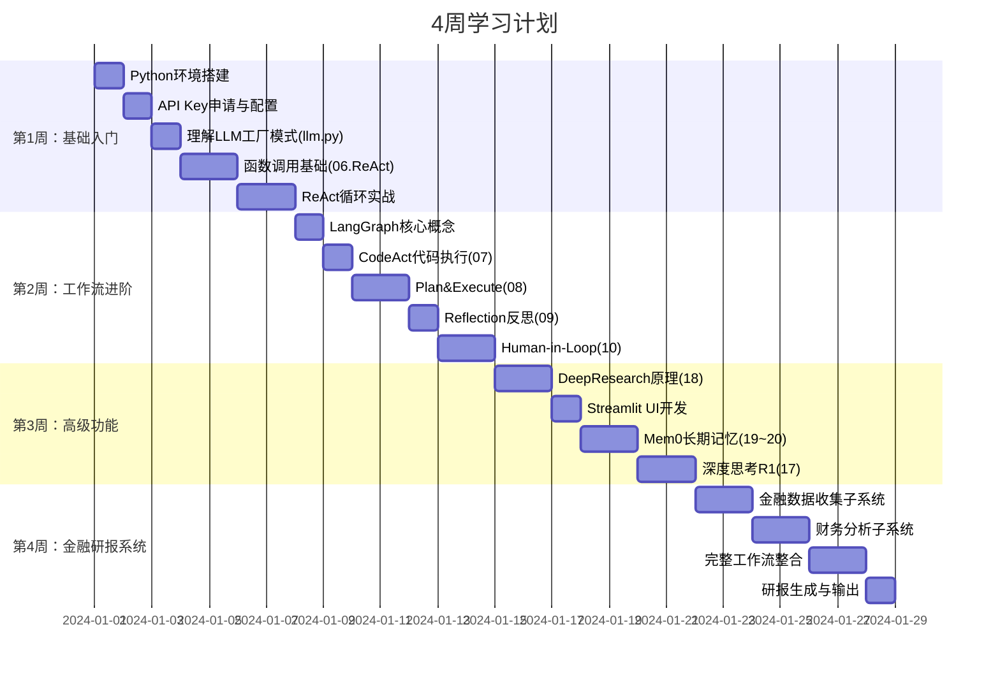
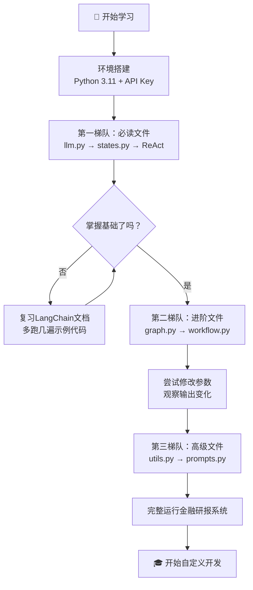

# 学习手册

> 极客时间《DeepResearch前沿智能体实战课》系统化学习指南

---

## 目录

1. [学习前置要求](#1-学习前置要求)
2. [学习路径图](#2-学习路径图)
3. [核心文件解析（按重要程度排序）](#3-核心文件解析按重要程度排序)
4. [关键功能实现原理](#4-关键功能实现原理)
5. [常见问题与调试技巧](#5-常见问题与调试技巧)
6. [学习进度建议与实践任务](#6-学习进度建议与实践任务)

---

## 1. 学习前置要求

### 1.1 编程基础

在开始学习本课程之前，你需要具备以下知识：

| 知识点 | 要求程度 | 学习建议 |
|--------|---------|---------|
| Python 基础语法 | **必须掌握** | 变量、函数、类、列表、字典 |
| Python 异步编程（async/await）| **建议了解** | 部分模块使用异步 |
| 命令行基础（Windows CMD）| **必须掌握** | 安装依赖、运行脚本 |
| JSON/YAML 格式 | **建议了解** | 配置文件和结构化输出 |
| HTTP 基础概念 | **建议了解** | API 调用原理 |

> 💡 **初学者提示：** 如果你对 Python 还不熟悉，建议先完成任意一个 Python 入门课程（例如廖雪峰的 Python 教程）。本课程使用 Python 3.11，请确保版本匹配。

### 1.2 API 申请指南

本项目需要申请以下 API Key：

#### DeepSeek API（必须）

1. 访问 [platform.deepseek.com](https://platform.deepseek.com)
2. 注册账号并实名认证
3. 进入「API Keys」页面，点击「创建 API Key」
4. 复制生成的 Key（格式：`sk-xxxxxxxxxxxxxxxxxxxxxxxx`）
5. 充值一定额度（新用户通常有免费额度）

> ⚠️ **注意：** DeepSeek API Key 只显示一次，请务必保存。如果忘记，需要重新创建。

#### 通义千问 API（可选，部分模块使用）

1. 访问 [dashscope.aliyun.com](https://dashscope.aliyun.com)
2. 注册阿里云账号
3. 开通「灵积模型服务」
4. 进入控制台→「API-KEY管理」，创建 API Key
5. Key 格式：`sk-xxxxxxxxxxxxxxxx`

#### Tavily API（用于 Web 搜索，11~12 和 18 模块需要）

1. 访问 [app.tavily.com](https://app.tavily.com)
2. 注册账号
3. 在控制台找到 API Key（格式：`tvly-xxxxxxxxxxxxxxxx`）
4. 免费计划每月有一定的搜索次数限制

### 1.3 环境依赖清单

```
Python           3.11.x（必须是 3.11）
Git              2.x
pip              23.x+
```

**核心 Python 包：**

```
langchain            0.3.x
langchain-openai     0.2.x
langchain-deepseek   0.1.x
langgraph            0.2.x
langchain-mcp-adapters 0.1.x
streamlit            1.40.x
python-dotenv        1.0.x
tavily-python        0.5.x
akshare             1.14.x（金融模块）
pandas              2.x（金融模块）
python-docx         1.x（金融模块）
mem0ai              0.1.x（记忆模块）
browser-use         0.1.x（浏览器模块）
```

---

## 2. 学习路径图

### 2.1 推荐学习顺序（4 周计划）



### 2.2 学习路径流程图



---

## 3. 核心文件解析（按重要程度排序）

### 3.1 第一梯队（必读）

#### 📄 `21~26.financial/llm.py` ⭐⭐⭐⭐⭐

**为什么最先读：** 这是最简单的文件，只有 25 行，但展示了整个项目最核心的设计模式——**LLM 工厂函数**。

```python
import os
from dotenv import load_dotenv
from langchain_openai import ChatOpenAI
from langchain_deepseek import ChatDeepSeek

load_dotenv()  # 从 .env 文件加载环境变量

def DeepSeek():
    """返回 DeepSeek Chat 模型实例（通用任务）"""
    return ChatDeepSeek(
        model="deepseek-chat",
        api_key=os.environ.get("DEEPSEEK_API_KEY"),
    )

def DeepSeek_R1():
    """返回 DeepSeek Reasoner 模型实例（复杂推理）"""
    return ChatDeepSeek(
        model="deepseek-reasoner",
        api_key=os.environ.get("DEEPSEEK_API_KEY"),
    )

def Tongyi():
    """返回通义千问模型实例（备用 LLM）"""
    return ChatOpenAI(
        model="qwen-max",
        api_key=os.environ.get("TONGYI_API_KEY"),
        base_url="https://dashscope.aliyuncs.com/compatible-mode/v1",
    )
```

**学习要点：**
- `load_dotenv()`：自动加载当前目录的 `.env` 文件中的环境变量
- `os.environ.get("KEY")`：安全地读取环境变量（不存在时返回 `None`）
- 工厂函数模式：每次调用 `DeepSeek()` 都会创建一个新的 LLM 实例

> 💡 **初学者提示：** 通义千问使用 `ChatOpenAI` 而不是专用客户端，这是因为阿里云提供了 OpenAI 兼容的 API 接口（`base_url` 参数指向阿里云）。这种方式允许用一套代码切换不同厂商的 LLM。

---

#### 📄 `21~26.financial/states.py` ⭐⭐⭐⭐⭐

**为什么重要：** 定义了整个金融研报系统的"血管"——`OverallState`。理解状态定义是理解 LangGraph 工作流的前提。

```python
from typing import TypedDict, Dict, List, Any
from langgraph.graph import add_messages
from typing_extensions import Annotated
from schemas import CompetitorInfoList

class OverallState(TypedDict):
    # 用户输入的基本信息
    stock_code: str                              # 股票代码，如 "600519"
    stock_name: str                              # 公司名称，如 "贵州茅台"
    market: str                                  # 交易市场，如 "A股"
    year: list[str]                              # 分析年份列表
    
    # 消息历史（特殊：使用 add_messages 追加而非覆盖）
    messages: Annotated[list, add_messages]
    
    # 各阶段收集的数据
    competitor_and_industry_data: str            # 竞争对手原始文本
    competitor_info: CompetitorInfoList          # 结构化竞争对手列表
    company_report: Dict[str, Any]              # 各公司分析报告
    compare_company_report: Dict[str, Any]       # 对比分析报告
    shareholder_info: str                        # 股东信息
    valuation_model: str                         # 估值模型
    business_info: str                           # 主营业务信息
    formatted_output: List[str]                  # 格式化输出列表
    final_report: str                            # 最终报告路径
```

**学习要点：**
- `TypedDict`：Python 的类型化字典，提供类型检查但不强制
- `Annotated[list, add_messages]`：带有元数据的类型注解，告诉 LangGraph 如何合并该字段

---

#### 📄 `06.ReAct/react/` 目录 ⭐⭐⭐⭐⭐

这是理解最基础 ReAct 循环的最佳起点，文件最少，逻辑最清晰。

**`06.ReAct/react/tools.py`：工具定义**

```python
from langchain_core.tools import tool

@tool
def get_weather(city: str) -> str:
    """查询指定城市的天气情况
    
    Args:
        city: 城市名称，如 "北京"、"上海"
    
    Returns:
        天气描述字符串
    """
    # 实际代码调用天气 API
    return f"{city}今天晴，气温 25°C"
```

> 💡 **初学者提示：** `@tool` 装饰器最关键的是函数的 **docstring（文档字符串）**！LLM 通过阅读 docstring 来决定何时调用这个工具以及传什么参数。docstring 写得越清晰，LLM 的工具使用就越准确。

**`06.ReAct/react/agent.py`：创建 ReAct 智能体**

```python
from langgraph.prebuilt import create_react_agent
from llm import DeepSeek
from tools import get_weather, search_web

# 只需 3 行代码就能创建一个完整的 ReAct 智能体
llm = DeepSeek()
tools = [get_weather, search_web]
agent = create_react_agent(llm, tools)

# 运行智能体
result = agent.invoke({
    "messages": [{"role": "user", "content": "北京明天天气怎么样？"}]
})
print(result["messages"][-1].content)
```

---

#### 📄 `18.deepresearch/app.py` ⭐⭐⭐⭐

**为什么重要：** 这是项目中唯一有图形界面的文件，展示了如何将 LangGraph 工作流与 Streamlit 结合，实现流式输出的 Web 应用。

**关键代码段——流式执行：**

```python
def stream_graph_execution(user_message: str):
    """流式执行 LangGraph，每完成一个节点就 yield 结果"""
    config = {
        "configurable": {
            "query_generator_model": st.session_state.config.query_generator_model,
            "reflection_model": st.session_state.config.reflection_model,
            "answer_model": st.session_state.config.answer_model,
            "number_of_initial_queries": st.session_state.config.number_of_initial_queries,
            "max_research_loops": st.session_state.config.max_research_loops,
        }
    }
    
    # graph.stream() 返回一个迭代器，每完成一个节点就 yield
    for step in graph.stream(
        {"messages": [HumanMessage(content=user_message)]},
        config=config,
        stream_mode="updates"  # 只返回状态变化（更新量）
    ):
        node_name = list(step.keys())[0]
        node_output = step[node_name]
        yield {"node": node_name, "output": node_output}
```

**关键代码段——Streamlit 会话状态：**

```python
# 使用 st.session_state 在多次渲染之间保持状态
if "messages" not in st.session_state:
    st.session_state.messages = []  # 对话历史
    
if "config" not in st.session_state:
    st.session_state.config = Configuration()  # 配置对象
```

---

### 3.2 第二梯队（进阶）

#### 📄 `18.deepresearch/agent/graph.py` ⭐⭐⭐⭐

DeepResearch 核心图定义，包含 5 个节点和条件路由逻辑。关键是理解 `evaluate_research` 如何使用 `Send` 实现并行搜索。

**重点代码——并行搜索 + 条件路由：**

```python
def continue_to_web_research(state: QueryGenerationState):
    """将搜索任务并行发送给多个 web_research 节点"""
    return [
        Send("web_research", {"search_query": query, "id": idx})
        for idx, query in enumerate(state["search_query"])
    ]

# 连接方式：从 generate_query 开始，并行到多个 web_research
builder.add_conditional_edges(
    "generate_query",
    continue_to_web_research,  # 路由函数
    ["web_research"]           # 目标节点
)
```

---

#### 📄 `21~26.financial/workflow.py` ⭐⭐⭐⭐⭐

完整的多智能体工作流，13 个节点，是整个课程最复杂的文件。建议在理解了前面所有模块之后再仔细阅读。

**关键学习点：**

1. **两种记忆的使用**：每个节点既有 `save_markdown`（长期记忆）也有 `return dict`（短期记忆）
2. **子 Agent 的调用方式**：每个子 Agent 都有统一的 `.run()` 接口
3. **结构化输出的应用**：`get_competitor_info` 节点使用 `with_structured_output(CompetitorInfoList)` 将文本转为对象

---

### 3.3 第三梯队（高级）

#### 📄 `21~26.financial/utils.py` ⭐⭐⭐

工具函数库，包含文件管理、数据读取、格式转换等实用功能。

**关键函数：**

| 函数 | 用途 |
|------|------|
| `save_markdown(content, filename, dir)` | 将字符串内容保存为 Markdown 文件 |
| `get_financial_caculates_file_map()` | 扫描计算结果目录，返回股票代码→文件路径的映射 |
| `read_csv(filepath)` | 读取 CSV 文件为字符串（供 LLM 分析） |
| `extract_images_from_markdown()` | 从 Markdown 中提取图片，复制到统一目录 |
| `format_markdown()` | 对 Markdown 内容进行格式美化 |
| `convert_to_docx()` | 将 Markdown 转换为 Word 文档 |

---

#### 📄 `21~26.financial/prompts.py` ⭐⭐⭐

提示词工程的最佳实践示例，包含所有主要的 System Prompt 和 User Prompt 模板。

**学习要点：**
- 使用 f-string 模板，通过 `.format(**params)` 动态填充数据
- System Prompt 定义角色和规范，User Prompt 提供具体任务
- 在提示词中明确指定输出格式（如"必须用```yaml包裹"）

---

## 4. 关键功能实现原理

### 4.1 流式输出：`graph.stream()` 的工作原理

LangGraph 的 `stream()` 方法是异步迭代器，每完成一个节点立即返回该节点的输出，不等待整个工作流完成。

```python
# stream_mode 参数说明
# "updates"：每个节点返回状态变化（增量）
# "values"：每个节点返回完整的当前状态
# "messages"：流式返回 LLM 的 token（实时打字效果）

for step in graph.stream(input_state, config=config, stream_mode="updates"):
    # step 是 {node_name: output_dict} 格式
    node_name = list(step.keys())[0]
    node_output = step[node_name]
    
    # Streamlit 中实时更新 UI
    st.write(f"节点 {node_name} 完成")
    st.json(node_output)
```

**为什么流式输出对用户体验很重要：**

金融研报生成可能需要 10-30 分钟。如果使用 `graph.invoke()`（等待全部完成），用户会看到一个空白页面，不知道系统是否在正常运行。使用 `graph.stream()`，用户能实时看到每个步骤的进展。

### 4.2 状态传递：LangGraph 中节点间如何共享状态

LangGraph 采用**不可变状态更新**的设计理念：

```
初始状态: {"stock_code": "600519", "stock_name": "贵州茅台"}
                    ↓
节点 get_competitor_and_industry_data 返回:
{"competitor_and_industry_data": "茅台的主要竞争对手是..."}
                    ↓
合并后状态: {
    "stock_code": "600519",          ← 保持不变
    "stock_name": "贵州茅台",         ← 保持不变
    "competitor_and_industry_data": "茅台的主要竞争对手是..."  ← 新增
}
                    ↓
下一个节点 get_competitor_info 可以通过 state["competitor_and_industry_data"] 读取
```

> 💡 **初学者提示：** 节点函数 `return {"key": value}` 不是替换整个状态，而是**更新**指定的键。未提及的键保持原值不变。这与普通 Python 字典赋值不同。

### 4.3 结构化输出：`with_structured_output` 的底层机制

`with_structured_output` 底层使用了两种机制之一：

**机制一：Function Calling（工具调用）**
- LLM 将输出格式化为工具调用参数
- LangChain 自动将参数解析为 Pydantic 对象
- DeepSeek、OpenAI 等支持 Function Calling 的模型使用此机制

**机制二：JSON Mode（JSON 模式）**
- 在 Prompt 中要求 LLM 输出符合 JSON Schema 的内容
- LangChain 将返回的 JSON 字符串解析为 Pydantic 对象
- 作为 Function Calling 不可用时的回退方案

```python
# 使用示例
class SearchQueryList(BaseModel):
    query: List[str] = Field(description="搜索查询列表")

# with_structured_output 自动选择最合适的机制
structured_llm = llm.with_structured_output(SearchQueryList)
result = structured_llm.invoke("生成3个搜索查询")
# result 是 SearchQueryList 对象，类型安全
print(result.query)  # ['query1', 'query2', 'query3']
```

### 4.4 长期记忆 vs 短期记忆

```
短期记忆（LangGraph State）
├── 存储位置：内存（Python 对象）
├── 生命周期：单次 workflow.invoke() 调用期间
├── 访问方式：state["字段名"]
├── 写入方式：节点函数 return {"字段名": 值}
└── 适用场景：节点间数据传递、中间结果

长期记忆（文件系统 / Mem0）
├── 存储位置：硬盘文件 (.md, .csv)
├── 生命周期：永久（直到手动删除）
├── 访问方式：open(file_path).read()
├── 写入方式：save_markdown(content, filename)
└── 适用场景：跨 Session 数据复用、断点续跑、调试输出
```

**金融研报系统中的实际应用：**

| 数据 | 短期记忆（State 字段）| 长期记忆（文件）|
|------|---------------------|--------------|
| 竞争对手信息 | `state["competitor_and_industry_data"]` | `竞争对手与行业均值数据.md` |
| 主营业务 | `state["business_info"]` | `主营业务与核心竞争力.md` |
| 股东结构 | `state["shareholder_info"]` | `股东信息数据.md` |
| 最终报告 | `state["final_report"]`（文件路径）| `深度财务研报分析_时间戳.md` |

---

## 5. 常见问题与调试技巧

### 5.1 API Key 配置错误排查

**问题：** `AuthenticationError: API key is invalid`

**排查步骤：**

```cmd
# 步骤 1：检查 .env 文件是否存在于正确位置
# .env 文件必须在你运行 python 命令的那个目录下
dir .env

# 步骤 2：检查 .env 文件格式（不能有空格、引号）
# 错误格式：
DEEPSEEK_API_KEY = "sk-xxx"    # ❌ 等号周围有空格且有引号
DEEPSEEK_API_KEY="sk-xxx"      # ❌ 有引号

# 正确格式：
DEEPSEEK_API_KEY=sk-xxxxxxxxxx  # ✅ 直接赋值，无引号无空格

# 步骤 3：手动验证 .env 加载
python -c "from dotenv import load_dotenv; import os; load_dotenv(); print(os.environ.get('DEEPSEEK_API_KEY', 'NOT FOUND'))"
```

> ⚠️ **注意：** 每个模块目录下都有独立的 `.env` 文件，切换到不同模块目录时，需要在对应目录创建 `.env` 文件。

### 5.2 LangGraph 状态键缺失错误

**问题：** `KeyError: 'messages'` 或 `KeyError: 'competitor_info'`

**原因：** 尝试访问 State 中尚未被初始化的字段。

**解决方案：**

```python
# ❌ 错误写法（直接访问可能不存在的键）
company_report = state["company_report"]

# ✅ 正确写法（使用 .get() 提供默认值）
company_report = state.get("company_report", {})

# ✅ 或者在访问前检查
if "company_report" in state and state["company_report"] is not None:
    company_report = state["company_report"]
else:
    company_report = {}
```

**初始化 State 时提供所有必要字段：**

```python
# 初始化工作流时，提供所有必要的初始值
workflow.invoke({
    "stock_code": "600519",
    "stock_name": "贵州茅台",
    "market": "A股",
    "year": ["2022", "2023", "2024"],
    "messages": [],
    "company_report": {},           # 提前初始化字典
    "compare_company_report": {},   # 提前初始化字典
    "formatted_output": []          # 提前初始化列表
})
```

### 5.3 DeepSeek 速率限制处理

**问题：** `RateLimitError: You exceeded your current quota`

**常见原因及解决方案：**

| 原因 | 解决方案 |
|------|---------|
| API 余额不足 | 前往 platform.deepseek.com 充值 |
| 请求频率过高 | 添加 `time.sleep(1)` 或 `max_retries=3` |
| 并发请求过多 | 减少并行搜索数量（降低 `number_of_initial_queries`）|

```python
# 在 LLM 初始化时设置重试参数
llm = ChatDeepSeek(
    model="deepseek-chat",
    api_key=os.environ.get("DEEPSEEK_API_KEY"),
    max_retries=3,      # 自动重试 3 次
    timeout=60,         # 超时 60 秒
)
```

### 5.4 Streamlit 刷新问题

**问题：** 修改代码后，Streamlit 页面不更新；或页面刷新后状态丢失。

**解决方案：**

```cmd
# 问题 1：代码修改不生效 → 强制重新加载
# 在浏览器中按 R 键，或点击页面右上角的 "Rerun"

# 问题 2：状态丢失 → 使用 st.session_state 持久化
# 错误写法（每次渲染都重置）：
messages = []

# 正确写法（在 session_state 中持久化）：
if "messages" not in st.session_state:
    st.session_state.messages = []
messages = st.session_state.messages

# 问题 3：streamlit 命令找不到
python -m streamlit run app.py  # 用模块方式运行
```

### 5.5 AKShare 数据获取失败

**问题：** `ConnectionError` 或 `数据获取失败`

**排查步骤：**

```python
# 步骤 1：测试 AKShare 基础连接
import akshare as ak
df = ak.stock_info_a_code_name()
print(df.head())  # 如果能看到数据，说明连接正常

# 步骤 2：检查网络（AKShare 需要访问境内数据源）
# 如果在海外服务器运行，可能需要使用镜像或代理

# 步骤 3：更新 AKShare 版本（数据源经常变动）
pip install akshare --upgrade

# 步骤 4：对于特定数据接口，检查文档
# https://akshare.akfamily.xyz/
```

### 5.6 ModuleNotFoundError 常见错误

| 错误信息 | 解决命令 |
|---------|---------|
| `No module named 'langchain_deepseek'` | `pip install langchain-deepseek` |
| `No module named 'langgraph'` | `pip install langgraph` |
| `No module named 'streamlit'` | `pip install streamlit` |
| `No module named 'akshare'` | `pip install akshare` |
| `No module named 'mem0'` | `pip install mem0ai` |
| `No module named 'browser_use'` | `pip install browser-use` |
| `No module named 'dotenv'` | `pip install python-dotenv` |

### 5.7 调试技巧

**技巧一：打印 LangGraph 节点的中间状态**

```python
def my_node(state: MyState) -> dict:
    print(f"[DEBUG] 进入节点，当前状态键: {list(state.keys())}")
    result = process(state)
    print(f"[DEBUG] 节点输出: {result}")
    return result
```

**技巧二：在 stream 中打印每个节点输出**

```python
for step in graph.stream(initial_state):
    node_name = list(step.keys())[0]
    print(f"\n{'='*50}")
    print(f"节点: {node_name}")
    print(f"输出: {step[node_name]}")
```

**技巧三：使用 LangSmith 追踪（可选）**

```python
# 在 .env 中添加：
LANGCHAIN_TRACING_V2=true
LANGCHAIN_API_KEY=your_langsmith_key
LANGCHAIN_PROJECT=my-project

# 然后正常运行代码，所有 LLM 调用都会自动记录到 LangSmith
```

---

## 6. 学习进度建议与实践任务

### 第 1 周：环境搭建 + ReAct 基础

**目标：** 能够独立运行 ReAct 智能体

**学习内容：**
- [ ] 安装 Python 3.11 并配置虚拟环境
- [ ] 申请 DeepSeek API Key 并成功调用
- [ ] 理解 `llm.py` 中的工厂模式
- [ ] 运行 `06.ReAct/functioncalling/functioncalling.py`
- [ ] 运行 `06.ReAct/react/agent.py`

**实践任务：**
1. **任务 1（简单）：** 修改 `tools.py` 中工具的 docstring，观察 LLM 行为变化
2. **任务 2（中等）：** 添加一个新的搜索工具（如查询股票价格），让 ReAct 智能体使用它
3. **任务 3（挑战）：** 参照 `06.ReAct` 的结构，为 `09.reflection` 模块创建一个新的反思工具

### 第 2 周：DeepResearch + Streamlit UI

**目标：** 能够运行 DeepResearch Web 界面并理解工作流

**学习内容：**
- [ ] 申请 Tavily API Key
- [ ] 运行 `18.deepresearch/app.py`（`streamlit run app.py`）
- [ ] 理解 `graph.py` 中的 5 个节点和条件路由
- [ ] 理解 `app.py` 中的流式输出实现
- [ ] 尝试不同的研究问题，观察工作流执行过程

**实践任务：**
1. **任务 1（简单）：** 修改 `configuration.py` 中的默认参数，增加初始查询数量
2. **任务 2（中等）：** 在 `app.py` 的侧边栏添加一个新的配置选项
3. **任务 3（挑战）：** 将 DeepResearch 的输出保存为 Markdown 文件（参照金融模块的 `save_markdown`）

### 第 3 周：Mem0 记忆 + 金融数据收集

**目标：** 理解长期记忆机制，能够运行金融数据收集子系统

**学习内容：**
- [ ] 运行 `19~20.mem0/mem0/` 下的示例
- [ ] 理解 Mem0 的语义搜索原理
- [ ] 阅读 `21~26.financial/financial_data_collection/` 代码
- [ ] 单独测试 `DataCollectionAgent` 的数据获取功能
- [ ] 阅读并理解 `states.py` 的所有字段

**实践任务：**
1. **任务 1（简单）：** 运行 `19~20.mem0/mem0/test/` 下的测试脚本
2. **任务 2（中等）：** 修改金融数据收集模块，新增一个数据字段（如市盈率）
3. **任务 3（挑战）：** 将 Mem0 长期记忆集成到 DeepResearch 智能体中

### 第 4 周：完整金融研报 Agent

**目标：** 能够端到端运行完整的金融研报生成系统

**学习内容：**
- [ ] 完整阅读 `workflow.py` 的 428 行代码
- [ ] 理解每个节点的输入输出和职责
- [ ] 理解两阶段工作模式
- [ ] 成功生成一份完整的金融研报

**实践任务：**
1. **任务 1（简单）：** 修改目标股票（将 `600519 贵州茅台` 改为你感兴趣的股票）
2. **任务 2（中等）：** 为工作流添加一个新的数据收集节点（如获取新闻舆情）
3. **任务 3（挑战）：** 参照 `18.deepresearch/app.py`，为金融研报系统创建 Streamlit Web 界面
